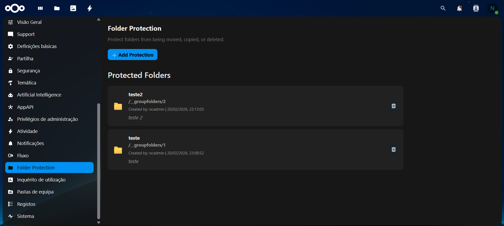
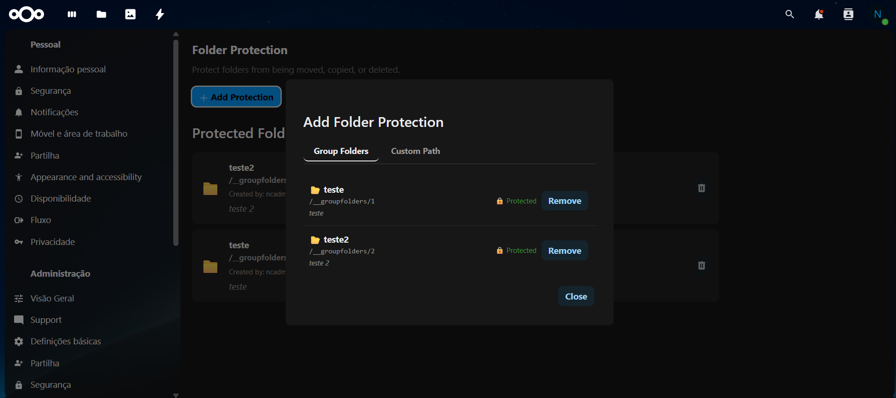
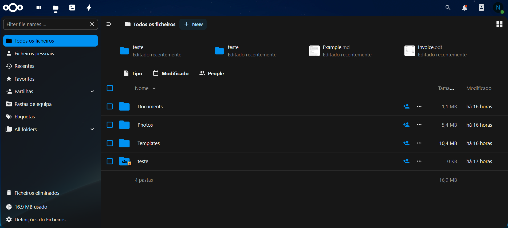

# Folder Protection for Nextcloud

Protect critical folders from accidental deletion, moving, or copying - preventing server crashes from massive file operations.

## Problem Solved

When users move 300GB+ folders, Nextcloud servers can crash or become unresponsive. This app prevents such operations on designated folders.

## Features

- Block delete, move, and copy operations on protected folders
- Two-layer protection (WebDAV + Storage layer)
- Distributed cache support (Redis/Memcached) for performance
- OCC commands for CLI management
- Web admin interface with Group Folder support
- Track who protected folders and why
- Desktop client aware: sync clients receive a 403 error with a descriptive message when attempting to delete or move a protected folder, which is shown in the "Not Synced" activity panel

## Installation

### Via App Store (Recommended)
1. Go to **Apps** in your Nextcloud
2. Search for "Folder Protection"
3. Click **Install**

### Manual Installation
```bash
cd /path/to/nextcloud/apps
git clone https://github.com/kreotropic/folder_protection.git folder_protection
cd folder_protection
npm install
npm run build
php occ app:enable folder_protection
```

## Usage

### Web Interface
Go to **Settings → Administration → Folder Protection**

### OCC Commands
```bash
# List all protected folders
php occ folder-protection:list

# Protect a folder (path as stored in DB, e.g. /files/ncadmin/important or /__groupfolders/1)
php occ folder-protection:protect "/files/ncadmin/important" --reason="Critical data"

# Remove protection by ID (use list to find the ID)
php occ folder-protection:unprotect 1

# Check if a path is protected
php occ folder-protection:check "/files/ncadmin/important"
```

### Group Folders
If the [Group Folders](https://github.com/nextcloud/groupfolders) app is installed, the admin panel shows a **Group Folders** tab where you can protect any group folder without being a member of the group.

## Known Limitations

- **Folder name is globally reserved while protection is active.** Because creation is blocked by folder name across the entire server, no user can create a new folder with the same name anywhere until the protection is removed by an administrator. Plan protection accordingly — remove it first if the folder needs to be replaced or renamed.

- **The "Copy" button is hidden in bulk selection whenever a protected folder is included in the selection.** Even if other non-protected folders are also selected, the Copy action will be hidden for the entire selection. This is a UI-level limitation: because copying a protected folder is blocked at the server level anyway, the button is hidden to avoid confusing error messages. To copy non-protected folders, deselect any protected folders first.

- **Deletion of any protected folder is reverted automatically.** When a user deletes a protected folder via the desktop client, the server rejects the operation and the folder is restored without user intervention. For regular protected folders the client suppresses the delete attempt entirely (no `D` permission in `oc:permissions`). For protected Group Folders the folder is always re-mounted from the database, so it reappears on the next sync regardless.

- **Dragging a regular protected folder on the same drive is blocked cleanly.** The desktop client sends a single atomic `MOVE` request; the server rejects it and no local copy is left behind.

- **Dragging a protected Group Folder, or cut-and-paste of any protected folder, leaves a spurious local copy.** In these cases the desktop client does not send a `MOVE` request. Instead it sends a `MKCOL` (create) at the destination followed by a `DELETE` at the source. The server blocks both, but the local copy at the destination is already created by the OS before the server responds. The sync client marks it as a sync error and does not remove it automatically, even after "Sync Now". **Workaround:** manually delete the spurious copy in Windows Explorer or Finder — the client will send a `DELETE` to the server, receive a 404 (the folder was never created there), and clear the error. The original protected folder remains unaffected.

## Translations

The app interface is available in:

- **English** (default)
- **Portuguese (Portugal)** / Português (Portugal)

Contributions for additional languages are welcome — add a `l10n/<locale>.json` and the corresponding `l10n/<locale>.js` file.

## Requirements

- Nextcloud 28 or later
- PHP 8.1 or later
- Redis or Memcached recommended (app works without it, using in-process cache)

## License

AGPL-3.0

## Contributing

Pull requests welcome! Please open an issue first to discuss significant changes.

## Screenshots







*The three snapshots above demonstrate the admin panel listing, the
"add protection" form and an individual protected path. These images are
picked up by the App Store crawler to showcase the app.*

## Support

- Issues: [GitHub Issues](https://github.com/kreotropic/folder_protection/issues)
- Forum: [Nextcloud Community](https://help.nextcloud.com)

## Author

Ricardo Ferreira
