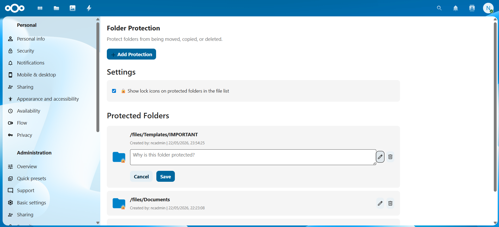
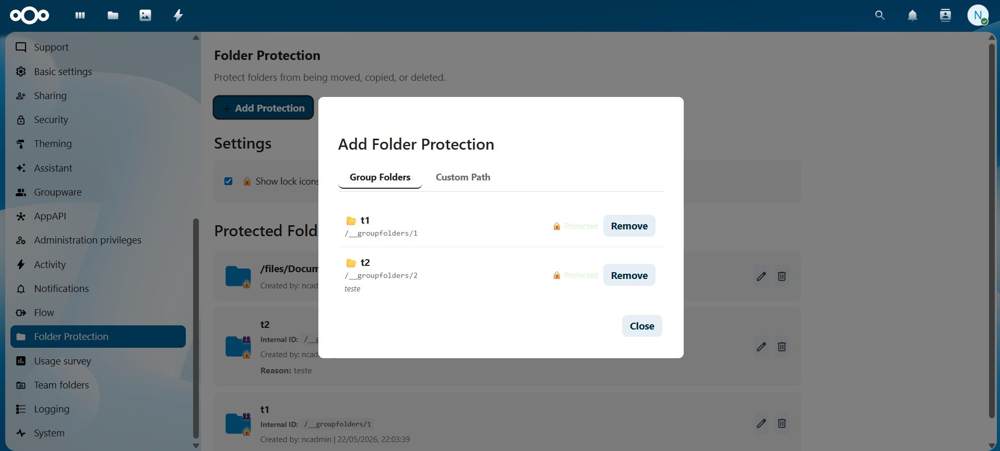
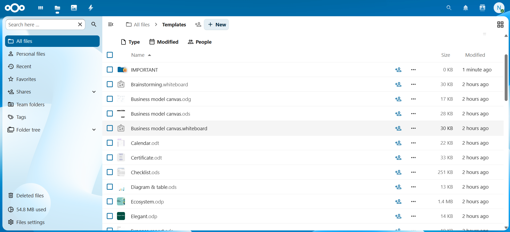

# Folder Protection for Nextcloud

Protect critical folders from accidental deletion, moving, or copying - preventing server crashes from massive file operations.

## Problem Solved

When users move 300GB+ folders, Nextcloud servers can crash or become unresponsive. This app prevents such operations on designated folders.

## Features

- Block delete, move, and copy of protected folders — protecting a subfolder also implicitly protects all its parent folders
- Two-layer protection (WebDAV + Storage layer)
- External storage support (SMB, S3, local mount, WebDAV, etc.)
- Group Folder support (protect any group folder from the admin panel without being a member)
- Distributed cache support (Redis/Memcached) for performance
- OCC commands for CLI management
- Web admin interface with tree-based folder picker (multi-select, expand/collapse)
- Dashboard widget listing all protected folders
- Track who protected each folder and why
- Desktop client aware: sync clients receive a 403 error with a descriptive message when attempting to delete or move a protected folder, which is shown in the "Not Synced" activity panel

## Installation

### Via App Store (Recommended)
1. Go to **Apps** in your Nextcloud
2. Search for "Folder Protection"
3. Click **Install**

### Manual Installation
```bash
cd /path/to/nextcloud/apps
git clone https://github.com/kreotropic/folder_protection.git folder_protection
cd folder_protection
npm install
npm run build
php occ app:enable folder_protection
```

## Usage

### Web Interface
Go to **Settings → Administration → Folder Protection**

### OCC Commands

Paths are stored **without the username** — use `/files/foldername`, not `/files/username/foldername`.

```bash
# List all protected folders
php occ folder-protection:list

# Protect a folder
php occ folder-protection:protect "/files/important" --reason="Critical data"

# Protect a group folder (use the numeric ID shown in the admin panel)
php occ folder-protection:protect "/__groupfolders/1" --reason="Shared data"

# Remove protection by ID (use list to find the ID)
php occ folder-protection:unprotect 1

# Check if a path is protected
php occ folder-protection:check "/files/important"

# Clear notification rate-limit cache (useful after testing)
php occ folder-protection:clear-notifications
```

### Group Folders
If the [Group Folders](https://github.com/nextcloud/groupfolders) app is installed, the admin panel shows a **Group Folders** tab where you can protect any group folder without being a member of the group.

### External Storage
Folders inside external storage mounts (SMB, S3, local mount, WebDAV, etc.) are fully supported. Protect the mount path as it appears in the user's files, e.g. `/files/myexternal`.

## Known Limitations

- **Protection is path-based, not per-user.** A protected path like `/files/reports` applies to every user who has a folder at that path. There is no way to protect a folder for one user without also protecting the same-named folder for all other users.

- **"Copy" button hidden in bulk selection** when any protected folder is included, even alongside non-protected ones. Copying a protected folder is blocked server-side anyway; hiding the button avoids a confusing error. To copy non-protected items, deselect any protected folders first.

- **Deletion is always reverted automatically.** The server rejects DELETE and the folder reappears on the next sync. For regular protected folders the desktop client also suppresses the delete attempt entirely (no `D` permission). For Group Folders the folder is re-mounted from the database regardless.

- **Dragging a regular protected folder is blocked cleanly.** The desktop client sends a single `MOVE` request; the server rejects it and nothing is left behind.

- **Dragging a protected Group Folder, or cut-and-paste of any protected folder, leaves a spurious local copy.** In these cases the client sends `MKCOL` at the destination then `DELETE` at the source. The server blocks both, but the local OS copy is already created before the server responds. The sync client marks it as a sync error and does not remove it after "Sync Now". **Workaround:** delete the spurious copy manually in Explorer or Finder — the client will send `DELETE` to the server, receive a 404, and clear the error. The original protected folder is unaffected.

## Translations

The app interface is available in:

- **English** (default)
- **Portuguese (Portugal)** / Português (Portugal)

Contributions for additional languages are welcome — add a `l10n/<locale>.json` and the corresponding `l10n/<locale>.js` file.

## Requirements

- Nextcloud 28–33
- PHP 8.1 or later
- Redis or Memcached recommended (app works without it, using in-process cache)

## License

AGPL-3.0

## Contributing

Pull requests welcome! Please open an issue first to discuss significant changes.

## Screenshots







*The three snapshots above demonstrate the admin panel listing, the
"add protection" form and an individual protected path. These images are
picked up by the App Store crawler to showcase the app.*

## Changelog

See [CHANGELOG.md](CHANGELOG.md) for the full version history.

## Support

- Issues: [GitHub Issues](https://github.com/kreotropic/folder_protection/issues)
- Forum: [Nextcloud Community](https://help.nextcloud.com)

## Author

Ricardo Ferreira
